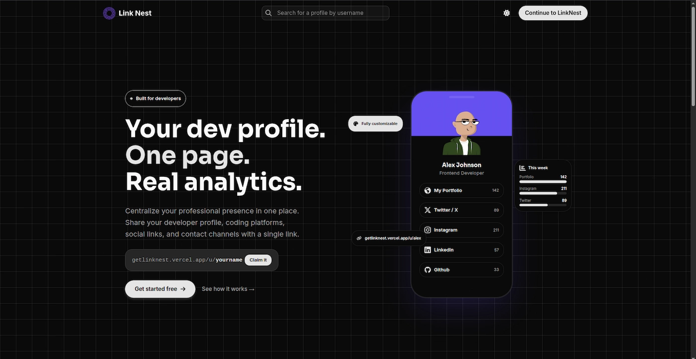

<div align="center">



# LinkNest

**The easiest way for developers to share their professional profile, links, and online presence in one place.**

[](https://getlinknest.vercel.app)
[](https://react.dev)
[](https://www.typescriptlang.org)
[](https://vitejs.dev)
[](https://tailwindcss.com)
[](https://firebase.google.com)
[](./LICENSE)

[Live Demo](https://getlinknest.vercel.app) · [Report a Bug](https://github.com/eddiedev14/linknest/issues) · [Request a Feature](https://github.com/eddiedev14/linknest/issues)

</div>

---

## Overview

**LinkNest** is a link-in-bio platform built specifically for developers. It lets users create a single, customizable public page where they can consolidate their GitHub, LinkedIn, portfolio, socials, and any other relevant link — with a profile that reflects their tech stack and professional status.

Beyond just hosting links, LinkNest gives users visibility into how their page performs: click counts, weekly trends, and per-link engagement, all from a clean, dedicated dashboard.

## Features

- **Authentication** — Email/password sign-up and sign-in, plus Google and GitHub OAuth providers, backed by Firebase Auth.
- **Password recovery** — Self-service password reset flow with transactional emails sent via Nodemailer.
- **Customizable profile** — Editable avatar and banner (with preset banners and image uploads via ImageKit), bio, professional status, and tech stack pills.
- **Link management** — Add, edit, delete, and reorder links via drag-and-drop, with platform-aware validation (each supported platform enforces its expected URL format).
- **Public profile page** — A shareable, SEO-friendly public page (`/u/:username`) showcasing the user's profile and links.
- **Analytics dashboard** — Track total clicks, link performance, and weekly trends through interactive charts (clicks, links, and platform breakdowns).
- **Dynamic sitemap** — Auto-generated `sitemap.xml` served through a Vercel serverless function for SEO.
- **Responsive design** — Fully responsive UI built with Tailwind CSS and Radix/shadcn primitives.

## Tech Stack

| Category             | Technology                                             |
| -------------------- | ------------------------------------------------------ |
| Frontend             | React 19, TypeScript, Vite                             |
| Styling & UI         | Tailwind CSS 4, Radix UI, shadcn, tailwind-animations  |
| Routing              | React Router                                           |
| Forms & Validation   | React Hook Form, Zod                                   |
| Drag & Drop          | @dnd-kit                                               |
| Charts               | Recharts                                               |
| Auth & Database      | Firebase Authentication, Firestore, Firebase Admin SDK |
| Image Hosting        | ImageKit                                               |
| Transactional Email  | Nodemailer, React Email                                |
| Serverless Functions | Vercel Functions (`/api`)                              |
| Analytics            | Vercel Analytics                                       |
| Deployment           | Vercel                                                 |

## Project Structure

```text
linknest/
├── api/                # Vercel serverless functions (Firebase Admin, ImageKit, mail, SEO)
├── emails/              # React Email templates
├── public/               # Static assets (favicon, fonts, images)
├── src/
│   ├── features/         # Feature-based modules
│   │   ├── analytics/     # Charts, stat cards, hooks
│   │   ├── auth/          # Auth forms, providers, hooks
│   │   ├── links/         # Link CRUD, drag-and-drop, validation
│   │   ├── profile/       # Profile, avatar & banner management
│   │   └── public-page/   # Public-facing profile rendering
│   ├── firebase/          # Firebase client config & types
│   ├── pages/             # Route-level pages
│   ├── router/            # App routing & route guards
│   └── shared/             # Shared components, data, and utilities
└── vercel.json            # Vercel rewrites config
```

## Getting Started

### Prerequisites

- [Node.js](https://nodejs.org) or [Bun](https://bun.sh)
- A [Firebase](https://firebase.google.com) project (Auth + Firestore)
- An [ImageKit](https://imagekit.io) account
- A Gmail account with an [App Password](https://support.google.com/accounts/answer/185833) for transactional emails

### Installation

```bash
git clone https://github.com/eddiedev14/linknest.git
cd linknest
npm install
```

### Environment Variables

Create a `.env` file in the project root with the following variables:

```env
APP_URL=

# FIREBASE
VITE_FIREBASE_API_KEY=
VITE_FIREBASE_AUTH_DOMAIN=
VITE_FIREBASE_PROJECT_ID=
VITE_FIREBASE_STORAGE_BUCKET=
VITE_FIREBASE_MESSAGING_SENDER_ID=
VITE_FIREBASE_APP_ID=

# IMAGEKIT
VITE_IMAGEKIT_PUBLIC_KEY=
VITE_IMAGEKIT_URL_ENDPOINT=
IMAGEKIT_PRIVATE_KEY=
IMAGEKIT_PUBLIC_KEY=
IMAGEKIT_URL_ENDPOINT=

# VERCEL VARIABLES
FIREBASE_PROJECT_ID=
FIREBASE_CLIENT_EMAIL=
FIREBASE_PRIVATE_KEY=

# NODEMAILER
GMAIL_USER=
GMAIL_APP_PASSWORD=
```

### Run Locally

In one terminal tab run (for Serverless Functions):

```bash
vercel dev
```

In another terminal tab run (Vite Server):

```bash
bun run dev
```

The app will be available at `http://localhost:5173`.

### Other Scripts

```bash
npm run build      # Type-check and build for production
npm run preview    # Preview the production build locally
npm run lint        # Run ESLint
npm run email:dev  # Preview email templates with react-email
```

## Project Goals

- Provide developers with a purpose-built, no-friction alternative to generic link-in-bio tools.
- Apply a feature-based, scalable frontend architecture with React and TypeScript.
- Implement secure, multi-provider authentication with Firebase.
- Give users actionable insight into their profile performance through analytics.
- Continuously optimize Core Web Vitals (LCP, INP, CLS) and bundle size, as tracked in [`CHANGELOG-perf.md`](./CHANGELOG-perf.md).

## License

This project is licensed under the [MIT License](./LICENSE).

---

<p align="center">
  Made with ♥️ love by <strong>Eddie Santiago Delgado Campo</strong><br />
  <a href="https://github.com/eddiedev14">@eddiedev14</a>
</p>
